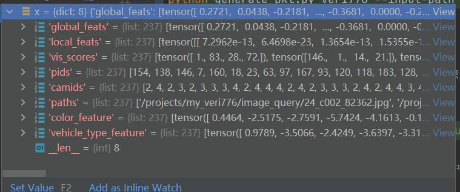

## Vehicle Re-identification base on multi-scale methods


## Project Struction


## Preprocess Dataset
- 生成推理pkl文件时选择inference为True, 则不会检索gallery图像
```shell
python generate_pkl.py veri776 --input-path ../my_veri776 --output-path ./outputs/my_veri776.pkl --inference 1
```

## Feature Metrics fusion
- 在`plot_rank.py`中的


## Reid Process
- 该车辆重识别网络主要由[车辆解析网络](https://github.com/silverbulletmdc/PVEN), 和颜色车型识别网络组成
- Run
```shell
python inference.py --reid-pkl-path './outputs/xxx.pkl' --ouput-path './outputs' --config './configs/my.yml'
```
- 推理过程中的详细配置可参照`default_config.py`中的参数配置自定义的my.yml文件(建议不要修改default_config.py)
- 得到的特征矩阵示例


### Visualization
- 运行`plot_rank.py`脚本
- PS: 目前只是根据distmat(PVEN 全局特征加局部特征)进行排序预测
```
python plot_rank.py --pkl-path ./outputs/my_outputs/test_output.pkl --rank-num 5 --plot 1
``` 
